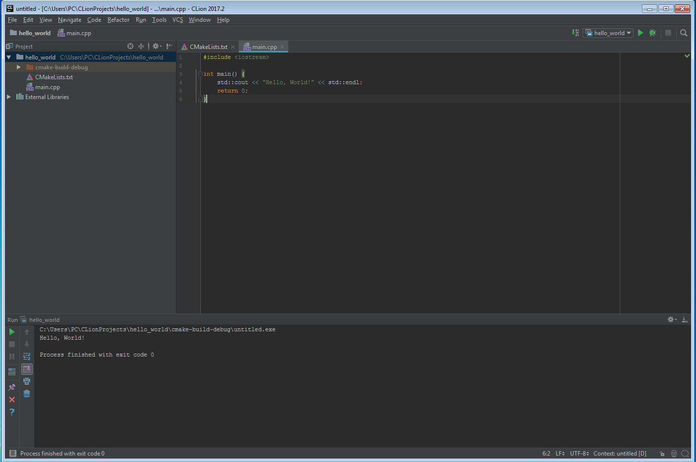

# Get Started 

## What do I need to start with CLion?

In general to develop in C/C++ with CLion you need:

* CMake, 2.8.11+ (Check JetBrains guide for updates)
* GCC/G++/Clang (Linux) or
* MinGW 3.* or MinGW — w64 3.-4. or Cygwin 1.7.32 (minimum required) up to 2.0.* (Windows)

## Downloading and Installing CMake

Downloading and installing CMake is pretty simple, just go to the [website](https://cmake.org/), download and install by following the recommended guide there or the on Desktop Wizard.

* Download and install file `cmake-3.9.0-win64-x65.msi` 

```
> cmake
Usage

  cmake [options] <path-to-source>
  cmake [options] <path-to-existing-build>

Specify a source directory to (re-)generate a build system for it in the
current working directory.  Specify an existing build directory to
re-generate its build system.

Run 'cmake --help' for more information.
```

## Downloading and Getting Cygwin

Cygwin is a large collection of GNU and Open Source tools which provide functionality similar to a Linux distribution on Windows

1. Download file `setup-x86_64.exe` from the website [https://cygwin.com/install.html](https://cygwin.com/install.html)

2. Install `setup-x86_64.exe` file


This is the root directory where Cygwin will be located, usually the recommended C:\ works


Choose where to install LOCAL DOWNLOAD PACKAGES: This is not the same as root directory, but rather where packages (ie. extra C libraries and tools) you download using Cygwin will be located


Follow the recommended instructions until you get to packages screen:


Once you get to the packages screen, this is where you customize what libraries or tools you will install. From here on I followed the above guide but here’s the gist:

From this window, choose the Cygwin applications to install. For our purposes, you will select certain GNU C/C++ packages.

Click the + sign next to the Devel category to expand it.

You will see a long list of possible packages that can be downloaded. Scroll the list to see more packages.

Pick each of the following packages by clicking its corresponding “Skip” marker.

* `gcc-core`: C compiler subpackage
* `gcc-g++`: C++ subpackage
* `libgcc1`: C runtime library
* `gdb`: The GNU Debugger
* `make`: The GNU version of the ‘make’ utility
* `libmpfr4` : A library for multiple-precision floating-point arithmetic with exact rounding

## Download and install CLion

Download file `CLion-2017.2.exe` from website [https://www.jetbrains.com/clion/download/#section=windows](https://www.jetbrains.com/clion/download/#section=windows)


Config environment File > Settings... > Build, Execution, Deployment

* Choose `Cygwin home`: `C:\cygwin64`
* Choose `CMake executable`: `Bundled CMake 3.8.2`


